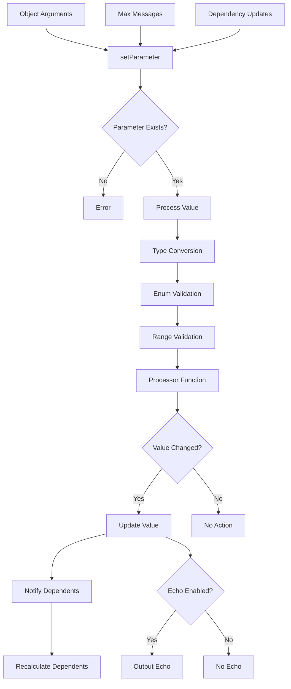
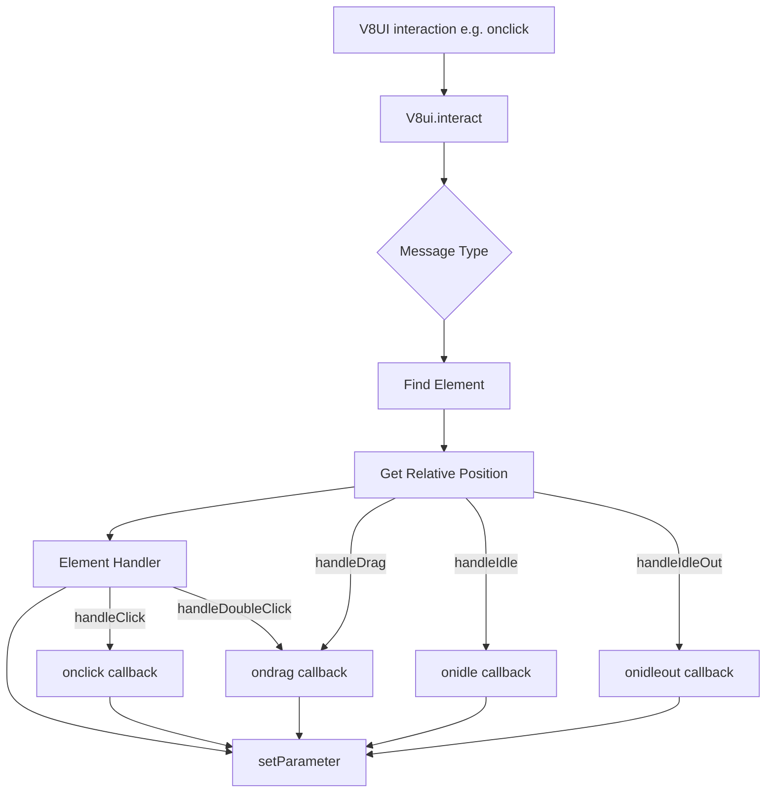

# V8ui Parameter Setting Process

## Description

This flowchart shows the parameter setting process in the V8ui system:

1. Parameters are defined with their configuration (type, default, enum, etc.) and instantiated with their current state
2. Parameter values can be changed from three sources:
   - Object arguments during initialization
   - Max messages during runtime
   - Updates from dependent parameters
3. When a parameter is set:
   - First checks if the parameter exists in the parameter definitions
   - If it doesn't exist, throws an error
   - If it exists, proceeds with value processing:
     - Type conversion
     - Enum validation
     - Range validation
     - Processor function application
4. If the processed value is different:
   - The value is updated
   - Dependent parameters are notified and recalculated
   - If echo is enabled, the value is output
5. If the processed value is the same, no action is taken

# V8ui Interaction Process

## Description

This flowchart shows the interaction process in the V8ui system:

1. Max events (mouse/touch) trigger the `interact` method
2. The interaction is routed to the appropriate handler based on message type
3. The system finds the element at the interaction position
4. Coordinates are converted to relative position within the element
5. The element's event handler is called
6. If defined, the corresponding callback (onclick, ondblclick, etc.) is executed
7. The callback can return new parameter values which are set through `setParameter`
